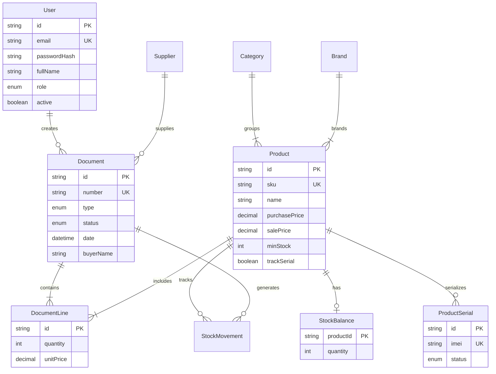

# ER-діаграма (логічна модель)

```mermaid
erDiagram
  User ||--o{ Document : creates
  Supplier ||--o{ Document : supplies
  Document ||--|{ DocumentLine : contains
  Product ||--|{ DocumentLine : includes
  Product ||--o| StockBalance : has
  Product ||--o{ StockMovement : tracks
  Product ||--o{ ProductSerial : serializes
  Document ||--o{ StockMovement : generates
  Category ||--|{ Product : groups
  Brand ||--|{ Product : brands

  User {
    string id PK
    string email UK
    string passwordHash
    string fullName
    enum role
    boolean active
  }

  Product {
    string id PK
    string sku UK
    string name
    decimal purchasePrice
    decimal salePrice
    int minStock
    boolean trackSerial
  }

  Document {
    string id PK
    string number UK
    enum type
    enum status
    datetime date
    string buyerName
  }

  DocumentLine {
    string id PK
    int quantity
    decimal unitPrice
  }

  StockBalance {
    string productId PK
    int quantity
  }

  ProductSerial {
    string id PK
    string imei UK
    enum status
  }
```
