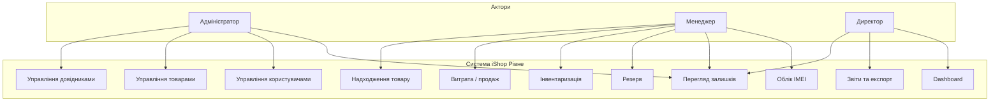

# Діаграма випадків використання

```mermaid
flowchart TB
  subgraph actors [Актори]
    Admin[Адміністратор]
    Manager[Менеджер]
    Director[Директор]
  end

  subgraph system [Система iShop Рівне]
    UC1[Управління довідниками]
    UC2[Управління товарами]
    UC3[Управління користувачами]
    UC4[Надходження товару]
    UC5[Витрата / продаж]
    UC6[Інвентаризація]
    UC7[Резерв]
    UC8[Перегляд залишків]
    UC9[Облік IMEI]
    UC10[Звіти та експорт]
    UC11[Dashboard]
  end

  Admin --> UC1
  Admin --> UC2
  Admin --> UC3
  Manager --> UC4
  Manager --> UC5
  Manager --> UC6
  Manager --> UC7
  Manager --> UC8
  Manager --> UC9
  Director --> UC8
  Director --> UC10
  Director --> UC11
  Admin --> UC8
```
